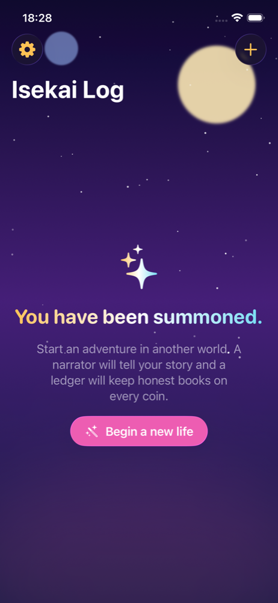
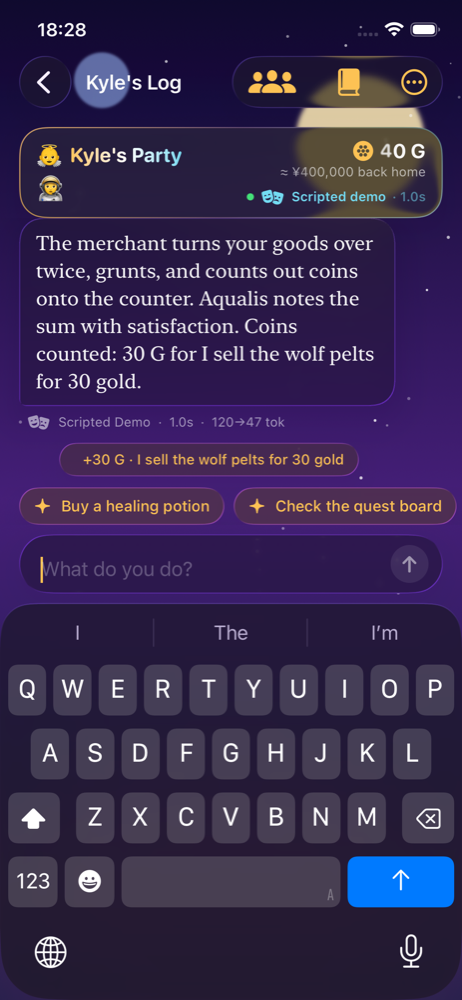
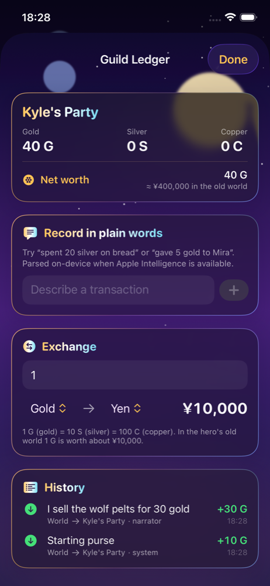

# Isekai Log（異世界ログ）

> An LLM roleplay adventure chat framework for iOS. Your log of another world.

Isekai Log tracks off-world adventures as chat logs. A narrator model runs the story in a
personality you choose, while a ledger keeps honest books on every coin, party and trade.
The narrator can run fully offline on Apple's on-device model or online through Claude.

Built for the Metanomaly iOS programming assignment (LLM Roleplay Adventure Chat Framework).

  

## Features

- **Roleplay chat framework** built from scratch: a `NarratorEngine` protocol, a `PromptBuilder`
  that turns world state into prompts, a structured `NarratorTurn` the model must fill in, and a
  SwiftData log of every turn.
- **Narrator personality via `instructions`**: four anime-flavoured presets (a goddess, a guild
  receptionist, a sealed demon lord, a slime companion) or free-text custom instructions. The text
  is handed to the model's `instructions` / system prompt verbatim, so it shapes every turn.
- **Offline and online modes**, switchable per adventure without losing the log:
  - *On-device*: Apple's `FoundationModels` system model with guided generation and streaming.
  - *Cloud*: Claude via the Anthropic Messages API with structured output.
  - *Scripted demo*: a deterministic rule-based narrator for simulators, previews and tests.
- **Backend bookkeeping with transactions and parties**: balances are derived from a transaction
  history, never stored. Transfers between parties are first-class and counterparties (guilds,
  merchants, rivals) are created automatically when money changes hands. The player party cannot
  overdraw; rejected events are reported back into the chat.
- **Bonus: income and expenses in natural language**. Narrator turns carry `ledgerEvents`, and the
  ledger screen accepts sentences like "spent 20 silver on bread", parsed on-device when Apple
  Intelligence is available and by a keyword parser otherwise.
- **Bonus: currency conversion** between gold, silver and copper, plus the isekai convention of
  showing the party's net worth in yen "back home" (1 G ≈ ¥10,000).
- **Model metrics** under every reply: engine, model id, latency and token counts. The whole log,
  metrics and ledger export as Markdown for playtest records.
- **Liquid glass UI** on iOS 26 with an "another world at dusk" theme and RPG status windows.
- Localized in English, Simplified Chinese (简体中文) and Japanese (日本語).

## Architecture

```
Isekai Log/
  Domain/Models/        Adventure, Party, PartyMember, ChatMessage, LedgerTransaction, Currency
  Narration/
    NarratorEngine      Protocol + TurnRequest / TurnUpdate / TurnMetrics / NarratorError
    NarratorTurn        @Generable structured turn (narration, ledgerEvents, suggestedActions)
    NarratorPersona     Personality presets whose text becomes the model instructions
    PromptBuilder       World state + trimmed history -> instructions and prompt (4,096-token aware)
    OnDeviceNarratorEngine   FoundationModels, guided generation, streaming, overflow retry
    CloudNarratorEngine      Anthropic Messages API, structured output, prompt caching, fallbacks
    ScriptedNarratorEngine   Deterministic narrator for demos and tests
  Ledger/
    Ledger              Atomic apply, overdraft protection, balances, counterparties, net worth
    NaturalLanguageLedgerParser   On-device model parser with keyword fallback
  Features/             AdventureList, NewAdventure, Chat (+ StatusWindow), Party, Ledger, Settings
  Support/              Theme (glass + sky), AppSettings, KeychainStore, TranscriptExporter
```

The engine layer has no UI or SwiftData dependency, and `PromptBuilder` and `Ledger` are covered
by unit tests. `ChatViewModel` orchestrates a turn: player message → prompt → engine stream →
narrator message → ledger events booked → system notes for applied and refused events.

## Model parameters

| Mode | Model | Parameters |
| --- | --- | --- |
| On-device | `SystemLanguageModel` (Apple Intelligence, ~3B, 4,096-token context) | `useCase: .general`, `guardrails: .permissiveContentTransformations`, temperature 0.8 (user adjustable), `maximumResponseTokens: 700`, guided generation into `NarratorTurn`, streamed snapshots, compact-prompt retry on `exceededContextWindowSize` |
| Cloud | `claude-opus-5-5` (default), `claude-sonnet-5-5`, `claude-haiku-4-5` | `max_tokens: 1024`, `output_config.format` JSON schema for `NarratorTurn`, `output_config.effort: low`, adaptive thinking (model default), `fallbacks: "default"` with the `server-side-fallback-2026-07-01` beta, system prompt cached with `cache_control: ephemeral` |
| Scripted | rule-based | keyword intent detection, deterministic templates, streamed word by word |

Per-turn metrics (latency, input and output tokens, engine, model id) are stored on each narrator
message, shown under the bubble, and included in the Markdown export.

## Getting started

```sh
open "Isekai Log.xcodeproj"
```

Select the `Isekai Log` scheme and run.

- **On-device mode** needs a device or Mac with Apple Intelligence enabled (iPhone 15 Pro or
  later, M-series iPad or Mac). The iOS Simulator uses the host Mac's model, so Apple Intelligence
  must be turned on in macOS System Settings for simulator runs.
- **Cloud mode** needs an Anthropic API key, entered in Settings and stored in the keychain.
- **Scripted demo** works everywhere and is what the UI tests use.

## Tests

```sh
xcodebuild test -project "Isekai Log.xcodeproj" -scheme "Isekai Log" \
  -destination 'platform=iOS Simulator,name=iPhone 16e'
```

- `Isekai LogTests` (Swift Testing): ledger atomicity and overdraft rules, currency conversion,
  prompt budgeting, natural-language parsing, cloud request shape and response decoding, and
  scripted end-to-end playthroughs through `ChatViewModel`.
- `Isekai LogUITests` (XCTest): creates an adventure in scripted mode, plays three turns including
  a refused purchase, opens the ledger and party screens, and saves screenshots to
  `/tmp/isekai-screens`.

## Project layout

```
Isekai Log/          App target (SwiftUI + SwiftData + FoundationModels)
Isekai LogTests/     Unit tests (Swift Testing)
Isekai LogUITests/   UI tests (XCTest)
docs/screenshots/    Captured from the UI test on the iPhone 16e simulator
```

## License

Copyright © 2026 Kyle Zhao. All rights reserved.
